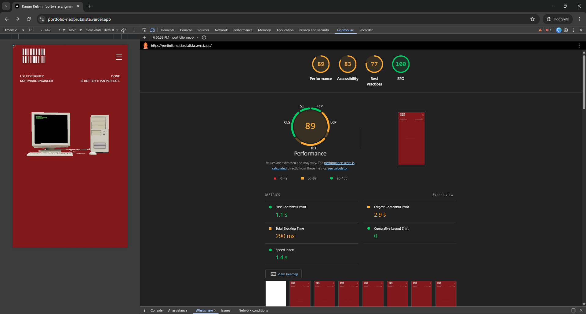

<div align="center">

  # Neo-Brutalist Developer Portfolio

  
  
  
  
  

  <br />

  <p align="center">
    Um portfólio imersivo focado em <strong>Performance Extrema</strong> e <strong>Design Neo-Brutalista</strong>.<br />
    Combinando renderização 3D interativa com as melhores práticas de Core Web Vitals.
  </p>

  <a href="https://portfolio-neobrutalista.vercel.app/">
    
  </a>

</div>

<br />

## O Conceito

Este projeto foge do padrão minimalista tradicional. A estética **Neo-Brutalista** utiliza tipografia ousada, contrastes altos, bordas marcadas e sombras duras para criar uma identidade visual única e memorável, sem sacrificar a usabilidade.

Além do design, o foco técnico foi a **Performance**. Sites com 3D costumam ser pesados, mas aqui foram aplicadas técnicas avançadas de otimização para garantir carregamento instantâneo.

---

## Performance & Mobile

| Desktop Experience | Lighthouse Score (Performance) |
|:---:|:---:|
|  |  |

---

## Tech Stack & Decisões Técnicas

* **Core:** [Next.js 16](https://nextjs.org/) (App Router & Server Components)
* **Linguagem:** TypeScript (Strict Mode)
* **3D Engine:** [React Three Fiber](https://docs.pmnd.rs/react-three-fiber) (Three.js wrapper para React)
* **Modelos 3D:** Compressão **Draco** para reduzir arquivos `.glb` em até 90%.
* **Estilização:** [Tailwind CSS v4](https://tailwindcss.com/)
* **Animações:** Framer Motion (Transições de página e micro-interações).
* **Emails:** Integração com [Resend API](https://resend.com/) para formulário de contato server-side.

## Otimizações Implementadas

1.  **Lazy Loading de 3D:** O modelo 3D pesado só é carregado quando necessário e usa `Suspense` para não bloquear a renderização inicial.
2.  **Otimização de Imagens:** Uso de `priority` na LCP (Largest Contentful Paint) e `sizes` corretos para responsividade.
3.  **Fontes:** `next/font` para zero layout shift (CLS).
4.  **Acessibilidade:** Semântica HTML correta e navegação via teclado.

## Como Rodar Localmente

1.  **Clone o repositório**
    ```bash
    git clone [https://github.com/kauannkelvinn/portfolio-neobrutalista.git](https://github.com/kauannkelvinn/portfolio-neobrutalista.git)
    cd portfolio-neobrutalista
    ```

2.  **Instale as dependências**
    ```bash
    npm install
    ```

3.  **Configure as variáveis de ambiente**
    Crie um arquivo `.env` na raiz com sua chave da Resend (para o formulário funcionar):
    ```bash
    RESEND_API_KEY=re_123456789
    ```

4.  **Rode o servidor**
    ```bash
    npm run dev
    ```

---

<div align="center">
  Desenvolvido por <a href="https://github.com/kauannkelvinn">Kauan Kelvinn</a>
</div>
